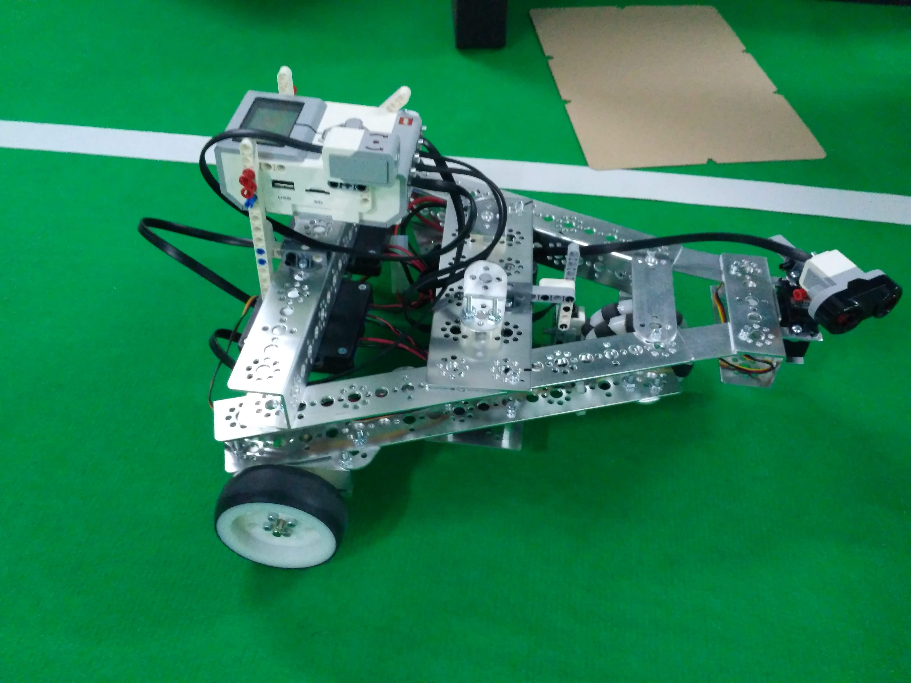

# ev3c_LFOA

An Implementation for ev3 mindstorm.

Libs for each sensor, motor etc and an simple example of line following and obstacle avoidance code.

:large_orange_diamond: Implemented Modules:
---------------------
:ballot_box_with_check: **Hitechnic DC Motors** (***I2C protocol***)

:ballot_box_with_check: **Hitechnic Servo Motor** (***I2C protocol***)

:ballot_box_with_check: **Lego Sensors** like color sesnor, sonar, etc.

---------------------------------------------------------------------------------------------
:large_orange_diamond: Main Project (ALL you need):
---------------------------
 * include/
 * src/
 * Makefile
 to run the programm

:bangbang: Notice :bangbang: :
-------
You can re-write LineFollowning and obstacle avoidance code as you wish (just ignore ~~***lfoa.c***~~ file).

***lfoa.c*** is a sample code to guide you through using libs for building a project on ev3. See it as an example on how to use the different modules.

:small_red_triangle_down: To Do List :construction: :
-----------
 - [ ] ev3_button

 - [ ] ev3_LCD
 
 :large_orange_diamond: Show Room :tv::tada: :
 ------------
 
 
 :sparkles:***Example Sonar-Obstacle Avoid -->***
 
 
 
 :sparkles:***ARM Servo Motion***
 
 

______________________________________________
:warning: READ quick guide for a fast set up and use.

:warning: READ carefully the block comments in each file.

:mailbox_with_mail: soylis.k@gmail.com

More infos for ev3dev see: https://www.ev3dev.org

 # :godmode: PEACE OUT! :sunglasses:
---------------------------------------------------------------------------------------------
